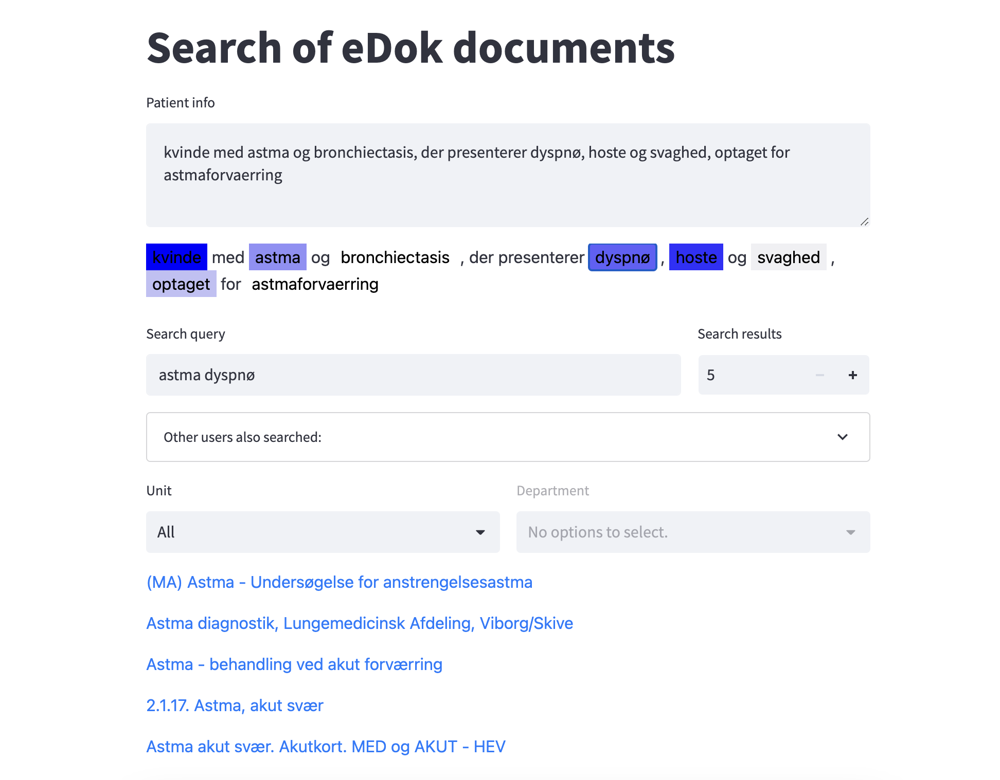

# Re2Dan - Retrieval of Medical Documents for e-Health in Danish

Code repository for Re2Dan, a web Retrieval and Recommender of Danish medical documents. Re2Dan leverages several techniques to improve the quality of retrieved documents. First, it combines lexical and semantic searches to understand the meaning and context of user queries, allowing the retrieval of documents that are conceptually similar to the user’s query. Second, it recommends similar queries, allowing users to discover related documents and insights. Third, when given contextual information (e.g., from patients’ clinical notes), it suggests medical concepts to expand the user query, enabling a more focused search scope and thus obtaining more accurate recommendations.

